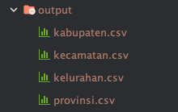

# Parse into csv Data Wilayah Indonesia
from git https://github.com/cahyadsn/wilayah

## Run from source
1. Clone Repository ```https://github.com/hasanbasri1993/wilayah-indonesia```
2. Run Main

## or Run form release
1. Download Release
2. Run it

## Output
